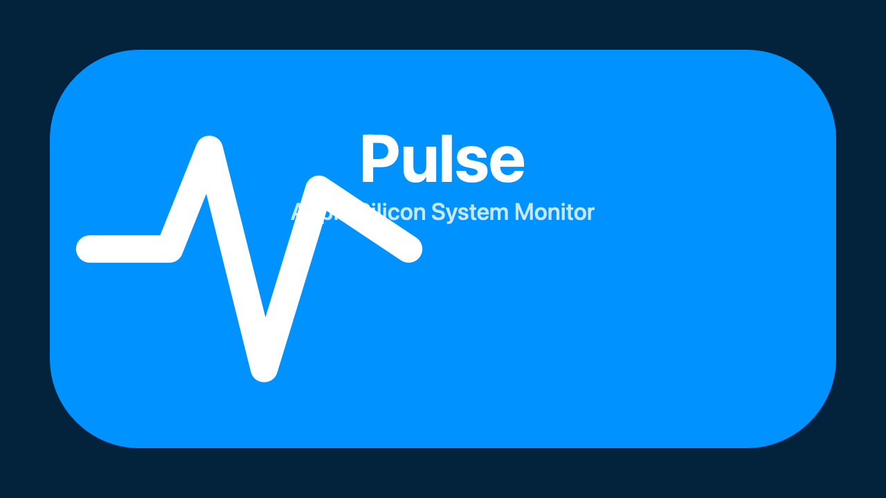

<div align="center">

# Pulse

**Apple Silicon のための、モダンなメニューバー型システムモニター**

[](https://www.apple.com/macos/)
[](https://support.apple.com/ja-jp/HT211814)
[](https://swift.org)
[](LICENSE)
[](https://github.com/hirofumi/pulse/releases)



</div>

## 概要

Pulse は、Apple Silicon Mac 向けに最適化されたシステムモニターです。
CPU・メモリ・ディスク・ネットワークの使用状況をメニューバーから一目で把握でき、
クリックすれば詳細なグラフと内訳を確認できます。

ネイティブの SwiftUI で構築されており、軽量で美しく、macOS の世界観に自然に溶け込みます。

## 主な特徴

- 🎨 **モダンな UI** — SwiftUI と Swift Charts による洗練された見た目
- ⚡ **超軽量** — アイドル時メモリ50MB以下、CPU使用率1%以下
- 🍎 **Apple Silicon ネイティブ** — arm64 専用、P-core/E-core を意識した設計
- 🔒 **プライバシー優先** — テレメトリなし、通信はアップデート確認のみ
- 🌗 **ダーク/ライトモード対応** — システム設定に自動追従
- 🔄 **アプリ内アップデート** — Sparkle による安全な自動更新

## 動作環境

| 項目 | 要件 |
|------|------|
| OS | macOS 14 Sonoma 以降 |
| アーキテクチャ | Apple Silicon(M1/M2/M3/M4 シリーズ)のみ |
| ディスク容量 | 約20MB |
| メモリ | 50MB 程度 |

> **注意**: Intel Mac には対応していません。

## 導入方法

### 方法 1: Homebrew でインストール(推奨)

[Homebrew](https://brew.sh/index_ja) がインストール済みであることを前提とします。

```bash
# 1. Pulse 用の tap を追加
brew tap hirofumi/tap

# 2. Pulse をインストール
brew install --cask pulse

# 3. Pulse を起動
open -a Pulse
```

以上で完了です。Launchpad または Spotlight からも起動できます。

### 方法 2: 手動インストール

1. [Releases ページ](https://github.com/hirofumi/pulse/releases/latest) から最新版の `Pulse-x.y.z.zip` をダウンロード
2. ZIP を展開して `Pulse.app` を `/Applications` フォルダへドラッグ
3. 初回起動時に「開発元を確認できないため開けません」と表示された場合:
   - 「システム設定」→「プライバシーとセキュリティ」を開く
   - 下部の「"Pulse" は開発元を確認できないためブロックされました」の横にある「このまま開く」をクリック
4. Pulse が起動し、メニューバーに表示されます

> **Tip**: Homebrew 経由でインストールすると、上記のセキュリティ確認手順を省略できます。

### 方法 3: GitHub からビルドして追加する

リリース版や Homebrew Cask がまだ公開されていない場合は、GitHub のソースコードから
ローカルでビルドして `Applications` フォルダへ追加できます。

```bash
# 1. ソースコードを取得
git clone https://github.com/hirofumi/pulse.git
cd pulse

# 2. Release ビルドを作成
xcodebuild -scheme Pulse -configuration Release \
  -derivedDataPath build/DerivedData build

# 3. Applications フォルダへ追加
ditto build/DerivedData/Build/Products/Release/Pulse.app /Applications/Pulse.app

# 4. Pulse を起動
open -a Pulse
```

この方法で追加した場合も、初回起動時に Gatekeeper の確認が表示されることがあります。
表示された場合は「方法 2: 手動インストール」の手順3を参照してください。

## アンインストール方法

### Homebrew でインストールした場合

```bash
brew uninstall --cask pulse
brew untap hirofumi/tap   # 不要であれば
```

### 手動でインストールした場合

```bash
# アプリ本体を削除
rm -rf /Applications/Pulse.app

# 設定・キャッシュを削除
rm -rf ~/Library/Application\ Support/Pulse
rm -f ~/Library/Preferences/com.hirofumi.pulse.plist
rm -rf ~/Library/Logs/Pulse
```

## 使い方

### メニューバー表示

メニューバーには、設定で選択した最大4項目のメトリクスが表示されます。
デフォルトでは **CPU 使用率 / メモリ使用率 / ネットワーク速度** が表示されます。

| 操作 | 動作 |
|------|------|
| **左クリック** | 詳細ポップオーバーを開く |
| **右クリック** | 設定・一時停止・終了などのメニューを表示 |

### 詳細ポップオーバー

クリックで開くポップオーバーには5つのタブがあります。

| タブ | 内容 |
|------|---------|
| 概要 | 全メトリクスの現在値とミニグラフ |
| CPU | コア毎の使用率、内訳、時系列チャート |
| メモリ | 使用量内訳、メモリプレッシャー、Swap、時系列 |
| ストレージ | ボリューム別容量、I/O 速度の時系列 |
| ネットワーク | インターフェース別の速度、時系列チャート |

### 設定

メニューバーアイコンを右クリック →「設定...」または `⌘,` で設定画面が開きます。

- **一般**: ログイン項目への追加方法など
- **表示**: メニューバーに表示する項目の選択と並び順
- **更新**: サンプリング間隔、自動アップデート確認の有無
- **単位**: 温度単位(℃/℉)、データ単位(SI/IEC)
- **情報**: バージョン、GitHub リンク

### ログイン時に自動起動する

現状、Pulse はコード署名なしで配布されているため、ログイン項目への自動登録機能を
アプリ内には組み込んでいません。以下の手順で手動登録してください。

1. 「システム設定」→「一般」→「ログイン項目」を開く
2. 「ログイン時に開く」セクションの「+」をクリック
3. `/Applications/Pulse.app` を選択して「開く」

## アップデート方法

Pulse は2通りの方法でアップデートできます。

### アプリ内からアップデート

設定画面の「更新」タブで「今すぐ確認」ボタンを押すと、新バージョンの有無が確認されます。
新バージョンがある場合はダイアログが表示され、その場でインストールできます。
自動アップデート確認(24時間ごと)を有効にしておくと、バックグラウンドで定期的に
チェックが行われます。

### Homebrew からアップデート

```bash
brew upgrade --cask pulse
```

> **補足**: アプリ内アップデートと Homebrew アップデートのどちらを使っても問題ありません。
> 両者は同じバージョンを参照しています。

## トラブルシューティング

### 「開発元を確認できないため開けません」と表示される

Pulse は Apple Developer Program 未加入のため、コード署名がされていません。
「導入方法 - 方法 2」の手順3を参照して、システム設定から起動を許可してください。
Homebrew Cask 経由でインストールした場合、この警告は表示されません。

### メニューバーに数値が表示されない

- アクティビティモニタで Pulse プロセスが動作しているか確認
- 一度アプリを終了し、再度起動してみてください
- 改善しない場合は [Issues](https://github.com/hirofumi/pulse/issues) で報告してください

### 表示される値が Activity Monitor と異なる

メモリ使用率は **App Memory + Wired + Compressed** の合計を物理メモリで割った値で計算しています(Activity Monitor の "メモリプレッシャー" と同じ計算方法)。
±5% 以上の差がある場合は不具合の可能性があるため、ご報告ください。

### Apple Silicon ではない Mac で動作しません

Pulse は Apple Silicon (arm64) 専用です。Intel Mac には対応していません。
Intel Mac をお使いの場合は [Stats](https://github.com/exelban/stats) など他のアプリをご検討ください。

## 開発者向け情報

ローカル環境での開発・ビルド方法については [docs/CONTRIBUTING.md](docs/CONTRIBUTING.md) を参照してください。

```bash
# リポジトリをクローン
git clone https://github.com/hirofumi/pulse.git
cd pulse

# Xcode で開く
open Pulse.xcodeproj

# コマンドラインからビルド
xcodebuild -scheme Pulse -configuration Debug build

# テスト実行
xcodebuild test -scheme Pulse -destination 'platform=macOS,arch=arm64'
```

技術スタックの詳細やアーキテクチャは [docs/ARCHITECTURE.md](docs/ARCHITECTURE.md) を参照してください。

## ロードマップ

### Phase 1(現在)

- ✅ CPU・メモリ・ディスク・ネットワークのメニューバー表示
- ✅ 詳細ポップオーバー(5タブ構成)
- ✅ 設定画面
- ✅ ダーク/ライトモード対応
- ✅ Sparkle によるアプリ内アップデート

### Phase 2(予定)

- ⏳ CPU 温度センサー対応
- ⏳ GPU・ANE 使用率の表示
- ⏳ パッケージ電力モニタリング
- ⏳ P-core / E-core 別の使用率
- ⏳ アプリ別リソース消費(top ライクなビュー)
- ⏳ 高負荷時の通知
- ⏳ バッテリー情報(MacBook 向け)

### Phase 3(構想)

- ⏳ 履歴データの永続化
- ⏳ ウィジェット連携
- ⏳ ショートカット App 連携
- ⏳ 英語 UI 対応

## 不具合報告・要望

[Issues](https://github.com/hirofumi/pulse/issues) からお寄せください。
報告の際は以下の情報を含めていただけると助かります。

- macOS のバージョン(例: macOS 14.5)
- Mac のモデル(例: MacBook Air M3)
- Pulse のバージョン(設定 →「情報」タブで確認)
- 再現手順
- 期待した動作と実際の動作

## ライセンス

[MIT License](LICENSE) で公開しています。

## 謝辞

- 設計の参考にした [Stats](https://github.com/exelban/stats)(Serhiy Mytrovtsiy 氏、MIT License)
- アプリ内アップデート機能を支える [Sparkle](https://sparkle-project.org/)
- Apple のすばらしい SwiftUI / Swift Charts フレームワーク

---

<div align="center">

Made with ❤️ for Apple Silicon

[GitHub](https://github.com/hirofumi/pulse) ・ [Issues](https://github.com/hirofumi/pulse/issues) ・ [Releases](https://github.com/hirofumi/pulse/releases)

</div>
